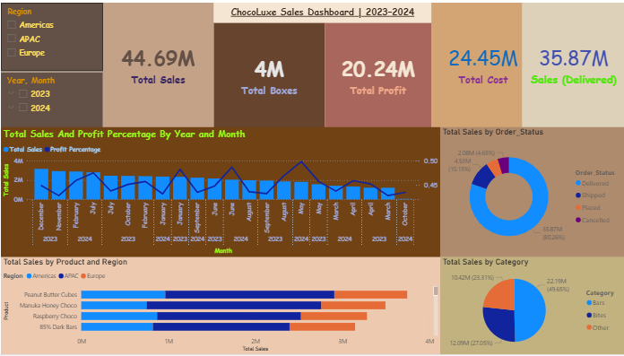

# 🍫 ChocoLuxe Sales Dashboard | 2023–2024

> **A deliciously beautiful Power BI dashboard** – rich chocolate-themed design, fully interactive, built on real chocolate sales data.

**Live Interactive Dashboard**
👉 [Open the live dashboard here] https://app.powerbi.com/view?r=eyJrIjoiNTAxNzZmODAtODQ2Yy00M2UyLTg1YzEtYmQ0YjgwMWZlODMxIiwidCI6ImFiNGQ0N2U3LWM3YTYtNDRlMy1iZGRmLTJlMTU5NDQ2MWVjOSJ9

**Download the full Power BI file**  

---

### Key Performance Highlights (2023 – Oct 2024)

| Metric                 | Value         | Notes                                    |
|------------------------|---------------|------------------------------------------|
| **Total Sales**        | **$44.69M**   | Across Americas, APAC, Europe            |
| **Total Boxes Sold**   | **4 million** |                                          |
| **Total Profit**       | **$20.24M**   |                                          |
| **Profit Margin**      | **45%**       | Consistently strong                     |
| **Delivered Sales**    | **$35.87M**   | 80.2% of total revenue                   |
| **Top Product**        | Peanut Butter Cubes | ~$3.5M+ sales                     |
| **Best Performing Region** | Americas   | Dominant across all categories           |
| **Top Category**       | Bars          | 49.5% of total sales ($22.13M)           |

---

### Dashboard Features

- Fully interactive slicers (Region, Year-Month)
- Monthly sales & profit trend with dual-axis visualization
- Product performance by region (stacked bar)
- Order status breakdown (Delivered / Shipped / Placed / Cancelled)
- Category contribution (Bars, Bites, Other)
- Chocolate-inspired color palette (beige, milk, dark brown, caramel accents)

---

### How to Open & Explore

1. **Download** the `.pbix` file from this repository
2. Open with **[Power BI Desktop](https://powerbi.microsoft.com/desktop/)** (free)
3. Click any slicer or visual – everything is fully interactive!
4. Publish to your own Power BI Service to share with your team

---

### Files in This Repository

| File                            | Description                                      |
|---------------------------------|--------------------------------------------------|
| `ChocoLuxe_Dashboard.pbix`     | Full interactive Power BI report                 |
| `preview.png`                   | High-res dashboard screenshot                    |
| `sample-chocolate-sales-data-all.xlsx` | Original dataset (optional)             |
| `README.md`                     | This file                                        |

---

### Tech Stack

- Microsoft Power BI Desktop
- DAX measures for Profit, Margin, YoY, etc.
- Star-schema model (Shipments + Calendar + Product + Locations + People)

---

### Want to Use or Modify?

Feel free to:
- Fork this repo
- Change the theme
- Add 2025 data
- Use as a template for your own sales dashboards

MIT License – go wild!

---

Made with ❤️ (and a lot of chocolate)  
*Your Name* – December 2025

---